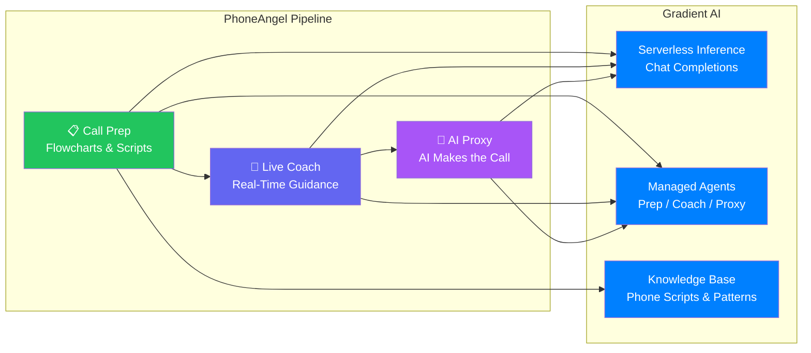
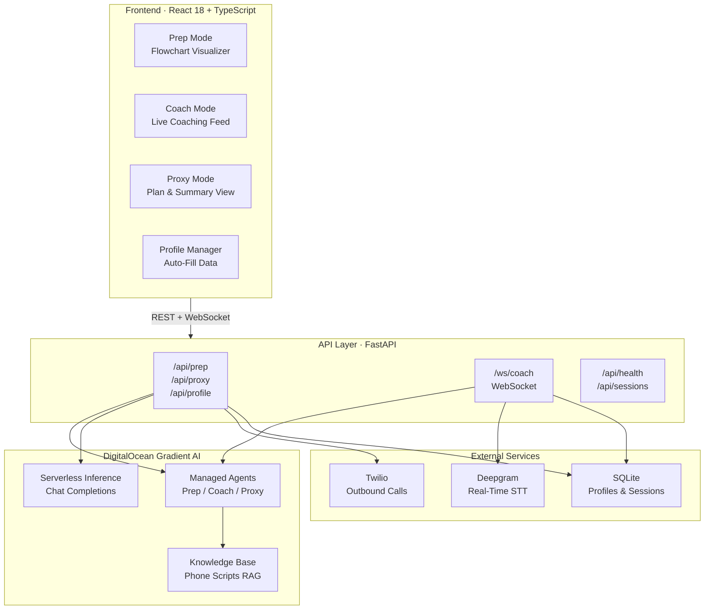
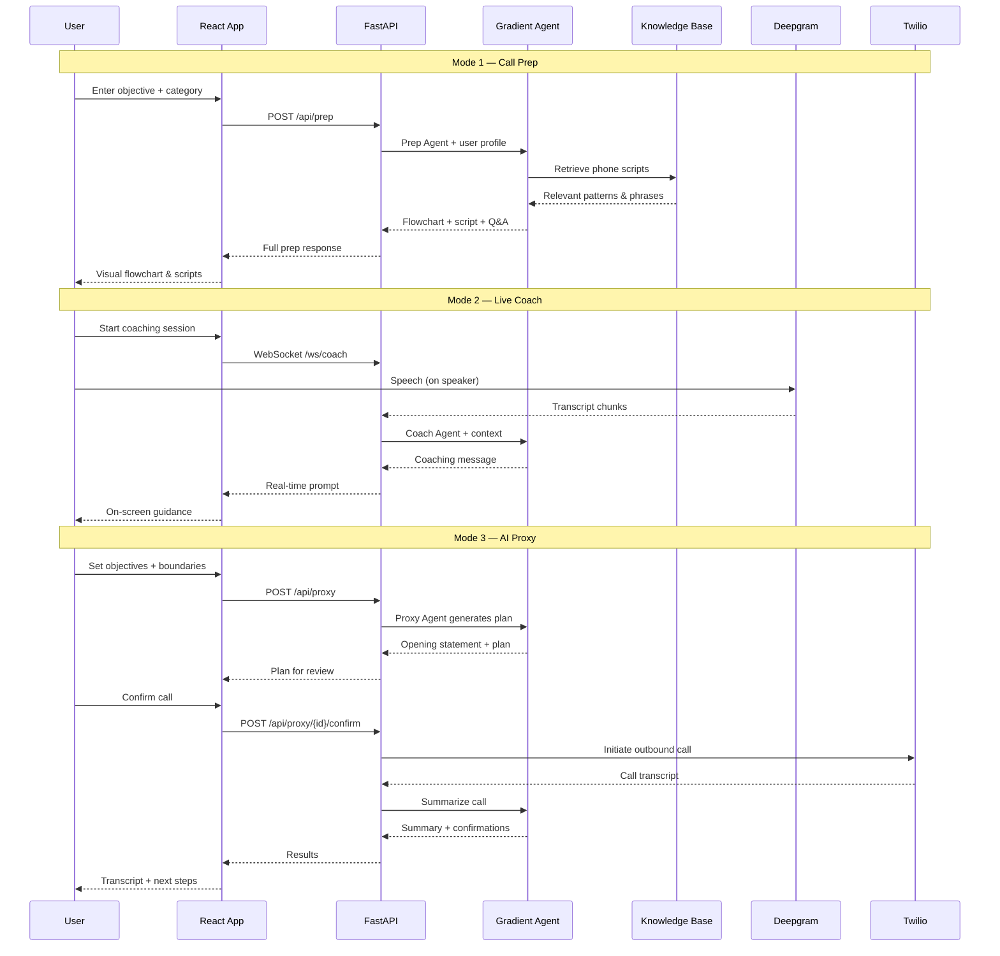

# PhoneAngel — AI Phone Call Assistant for Autistic Adults

[](https://www.python.org/downloads/)
[](https://fastapi.tiangolo.com/)
[](https://www.digitalocean.com/products/ai)
[](https://react.dev/)
[](https://opensource.org/licenses/MIT)

> **DigitalOcean Gradient AI Hackathon 2026** · Category: Accessibility · #GradientAI

**Never fear a phone call again — AI that preps you, coaches you live, or makes the call for you.**

## Quick Highlights

- **3 Modes**: Prep before → Coach during → Proxy instead — meet users at their comfort level
- **Conversation Flowcharts**: Visual, predictable scripts with word-for-word opening lines
- **Real-Time Coaching**: Live on-screen prompts, auto-filled answers, and decoded confusing phrases
- **AI Proxy Calls**: AI makes the call via Twilio, stays within your decision boundaries
- **Profile Auto-Fill**: Never panic when asked "what's your date of birth?" mid-call again
- **Knowledge Base**: Common phone patterns, decoded idioms, and coping strategies via RAG

## The Problem

Phone calls are something most people take for granted — scheduling a doctor's appointment, disputing a bill, reporting a maintenance issue. But for many autistic adults, phone calls are a massive barrier. The unpredictability, implied social meaning, real-time processing demands, and sensory overload cause severe anxiety.

| The Consequence | Because Of |
|---|---|
| Untreated medical conditions | Can't call to schedule appointments |
| Accumulated debt | Can't call to dispute bills |
| Lost housing | Can't report maintenance issues |
| Missed job opportunities | Can't handle phone interviews |

**No product exists that addresses this.** PhoneAngel is the first accessibility-focused phone call tool for neurodivergent adults.

## The Solution

PhoneAngel meets users where they are with **three escalating modes**:

### Mode 1: Call Prep (Before the Call)

Tell PhoneAngel what you need. It generates:
- A **visual conversation flowchart** showing every possible path
- A **word-for-word opening script** so you know exactly what to say
- Every **likely question** with pre-filled answers from your profile
- **Anxiety notes** explaining what's normal (hold music, transfers, silence)
- A **worst-case plan** so nothing catches you off guard

### Mode 2: Live Coach (During the Call)

Put the call on speaker. PhoneAngel listens via real-time speech-to-text and shows:
- On-screen **coaching prompts** that update as the call progresses
- **Auto-filled answers** from your profile (insurance ID, DOB, address)
- **Plain-English translations** of confusing phrases ("bear with me" = "please wait")
- **Reassurance messages** during hold times and silence

### Mode 3: AI Proxy (The Call Is Made For You)

When a call feels impossible, the AI makes it entirely:
- You set **objectives and decision boundaries**
- AI conducts the call via Twilio, staying within approved parameters
- You receive a **transcript, summary, and confirmation requests** afterward

## High-Level Workflow



### How Each Mode Works

| Mode | User Action | What Happens | Output |
|------|-------------|-------------|--------|
| **Prep** | Enters call objective | Gradient Agent generates full conversation flow | Flowchart, script, Q&A, anxiety notes |
| **Coach** | Speaks on call | Deepgram transcribes → Coach Agent analyzes in real-time | Live prompts, translations, auto-fill |
| **Proxy** | Sets boundaries, confirms plan | Proxy Agent generates plan → Twilio makes call | Transcript, summary, confirmations |

## Architecture & Technical Overview

### System Architecture



### Data Pipeline



### Technical Deep Dive

#### Gradient Client (`gradient_client.py`)

The Gradient client wraps DigitalOcean's AI services with two interfaces:

| Method | Service | Purpose |
|--------|---------|---------|
| `gradient_chat()` | Serverless Inference | OpenAI-compatible chat completions for general AI interactions |
| `gradient_agent_endpoint_json_chat()` | Managed Agents | Structured JSON responses from mode-specific agents |

**Reliability features**: Markdown fence stripping, JSON error recovery, and retry logic to handle occasional formatting inconsistencies.

#### Prep Agent (`prep_agent.py`)

Generates complete call preparation by:
- Predicting the full conversation flow as a tree of `FlowchartNode` objects
- Creating word-for-word opening scripts
- Listing likely questions with pre-filled answers from user profile
- Adding anxiety management notes explaining what's normal
- Planning worst-case scenarios

**Output**: Structured JSON with flowchart nodes, each containing speaker, text, suggested responses, coaching notes, and child branches.

#### Coach Agent (`coach_agent.py`)

`LiveCoachSession` maintains conversation state and processes transcript chunks:
- Tracks full transcript history and elapsed time
- Analyzes each new segment in context of the full conversation
- Returns typed coaching messages: `prompt`, `info`, `warning`, `reassurance`
- Includes auto-fill data from user profile when relevant

#### Proxy Agent (`proxy_agent.py`)

Manages the full proxy call lifecycle:
1. **Plan**: Builds context from request + profile, generates opening statement
2. **Execute**: Twilio makes the call with AI-generated script
3. **Summarize**: Analyzes transcript, extracts decisions, flags items needing user confirmation

#### Knowledge Base (`phone_scripts.md`)

RAG content providing grounded context to all agents:
- Medical appointment scripts and patterns
- Insurance call templates and common phrasing
- Utility company interaction patterns
- **Decoded confusing phrases** ("Let me pull up your account" = "They're searching, just wait")
- **What's normal** during calls (hold music, transfers, silence, automated menus)
- Coping strategies if overwhelmed

## DigitalOcean Gradient AI Usage

| Feature | How PhoneAngel Uses It |
|---|---|
| **Serverless Inference** | Chat completions power all three mode agents via OpenAI-compatible API |
| **Managed Agents** | Three dedicated agents (prep, coach, proxy) with custom system prompts and behavior |
| **Knowledge Base (RAG)** | Phone scripts, decoded phrases, and coping strategies as grounded context |
| **JSON Mode** | Structured output for flowcharts, coaching messages, and proxy plans |
| **App Platform** | Deployment of both backend and frontend |

## API Endpoints

| Method | Endpoint | Description |
|--------|----------|-------------|
| `POST` | `/api/profile` | Create or update user profile |
| `GET` | `/api/profile/{user_id}` | Retrieve user profile |
| `POST` | `/api/prep` | Generate call preparation (Mode 1) |
| `WS` | `/ws/coach/{user_id}` | Live coaching WebSocket (Mode 2) |
| `POST` | `/api/proxy` | Generate proxy call plan (Mode 3) |
| `POST` | `/api/proxy/{session_id}/confirm` | Initiate Twilio call |
| `POST` | `/api/proxy/{session_id}/summarize` | Summarize completed call |
| `GET` | `/api/sessions/{user_id}` | Get call history |
| `GET` | `/api/health` | Health check |

## Quick Start

### Prerequisites

- Python 3.12+
- Node.js 18+
- DigitalOcean API Token with Gradient AI access
- Deepgram API key
- Twilio credentials (for proxy mode)

### Setup

```bash
# Clone
git clone https://github.com/ankitlade12/phoneangel.git
cd phoneangel

# Install backend dependencies
uv sync

# Configure credentials
cp .env.example .env
# Edit .env with your API keys
```

### Run

```bash
# Start backend
uv run uvicorn phoneangel.app:app --reload --port 8000

# Start frontend (separate terminal)
cd frontend && npm install && npm run dev
```

### Demo

Open **http://localhost:5173** (frontend) · API docs at **http://localhost:8000/docs**

| Step | Action | What You'll See |
|------|--------|----------------|
| **1** | Fill in your profile | Name, DOB, insurance, sensory preferences saved |
| **2** | Try **Call Prep** | Enter "Schedule a dentist appointment" → get full flowchart + script |
| **3** | Try **Live Coach** | Start session → send transcript chunks → get real-time coaching |
| **4** | Try **AI Proxy** | Set objective + boundaries → review plan → AI makes the call |

## Project Structure

```
phoneangel/
├── src/phoneangel/
│   ├── app.py                    # FastAPI entry point
│   ├── config.py                 # Environment config (Pydantic)
│   ├── agents/
│   │   ├── gradient_client.py    # Gradient AI SDK wrapper
│   │   ├── prep_agent.py         # Mode 1: Call preparation
│   │   ├── coach_agent.py        # Mode 2: Live coaching
│   │   └── proxy_agent.py        # Mode 3: AI proxy caller
│   ├── api/
│   │   └── routes.py             # REST + WebSocket endpoints
│   ├── models/
│   │   ├── database.py           # Async SQLModel engine
│   │   └── schemas.py            # All data models & enums
│   └── knowledge_base/
│       └── phone_scripts.md      # RAG content for Gradient KB
├── frontend/
│   ├── src/
│   │   ├── App.tsx               # All UI components
│   │   ├── App.css               # TailwindCSS styling
│   │   └── main.tsx              # React entry point
│   ├── package.json              # npm dependencies
│   └── vite.config.ts            # Vite build config
├── tests/                        # Test suite
├── pyproject.toml                # uv project config
├── .env.example                  # Env template
└── LICENSE                       # MIT
```

## What Makes This Novel

| # | Innovation | Why It Matters |
|---|-----------|---------------|
| 1 | **Three escalating modes** | Meets users at their comfort level — from "help me prepare" to "do it for me" |
| 2 | **Conversation flowcharts** | Provides the predictability autistic adults need — see every possible path before dialing |
| 3 | **Real-time phrase decoding** | Translates neurotypical phone idioms into literal, clear language on the fly |
| 4 | **Profile auto-fill** | Eliminates the cognitive overload of recalling personal info under pressure |
| 5 | **Sensory-aware design** | Tracks hold time tolerance, voice sensitivity, and silence anxiety per user |
| 6 | **AI proxy with boundaries** | Full delegation with user control — AI stays within approved decision parameters |
| 7 | **Knowledge Base grounding** | RAG-powered responses with real phone scripts, not generic AI output |
| 8 | **Accessibility-first AI** | Not a general chatbot — every feature designed for neurodivergent communication needs |

## Impact

| Stat | Context |
|------|---------|
| **1 in 36** | Children diagnosed with autism in the US (CDC, 2023) — these children become adults who need to make phone calls |
| **85%** | Of autistic adults report significant anxiety around phone calls (National Autistic Society) |
| **>50%** | Of autistic adults avoid necessary phone calls, impacting healthcare, finances, and housing |

### Who Needs This

- **Autistic adults** navigating daily life tasks that require phone calls
- **Parents and caregivers** supporting autistic family members toward independence
- **Disability services** looking for assistive technology solutions
- **Therapists and coaches** working on phone call exposure therapy

## Tech Stack

| Layer | Technology | Purpose |
|-------|-----------|---------|
| **AI/LLM** | DigitalOcean Gradient AI | Serverless Inference + Managed Agents + Knowledge Base |
| **Backend** | Python 3.12, FastAPI | REST API + WebSocket server |
| **Database** | SQLModel + SQLite | User profiles and call session history |
| **Frontend** | React 18, TypeScript, TailwindCSS | Interactive UI with flowchart visualization |
| **Speech-to-Text** | Deepgram | Real-time streaming transcription |
| **Telephony** | Twilio | Outbound calls for proxy mode |
| **Package Management** | uv | Fast Python dependency management |
| **Deployment** | DigitalOcean App Platform | Cloud hosting |

## Environment Variables

| Variable | Required | Description |
|----------|----------|-------------|
| `DO_API_TOKEN` | Yes | DigitalOcean API token with Gradient AI access |
| `GRADIENT_MODEL` | Yes | Model name for serverless inference |
| `GRADIENT_AGENT_PREP_ID` | Yes | Managed agent ID for prep mode |
| `GRADIENT_AGENT_COACH_ID` | Yes | Managed agent ID for coach mode |
| `GRADIENT_AGENT_PROXY_ID` | Yes | Managed agent ID for proxy mode |
| `DEEPGRAM_API_KEY` | Yes | Deepgram API key for speech-to-text |
| `TWILIO_ACCOUNT_SID` | For proxy | Twilio account SID |
| `TWILIO_AUTH_TOKEN` | For proxy | Twilio auth token |
| `TWILIO_PHONE_NUMBER` | For proxy | Twilio outbound phone number |

## License

MIT License — see [LICENSE](LICENSE) file for details.

---

**Built with DigitalOcean Gradient AI (Serverless Inference + Managed Agents + Knowledge Base) for the DigitalOcean Gradient AI Hackathon 2026.**

*Never fear a phone call again.*
